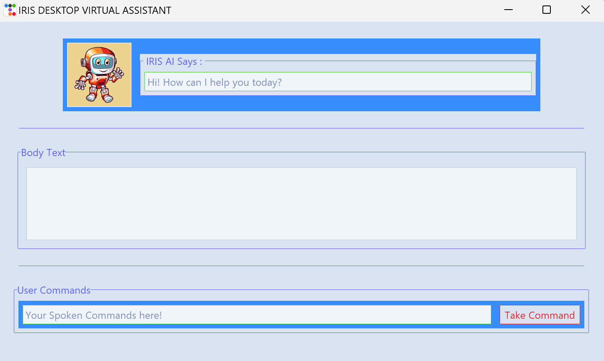

# IRIS Desktop Virtual Assistant

## Description:
IRIS is a voice-activated desktop assistant that can perform a variety of tasks such as playing music, searching Wikipedia, providing live news, opening applications, controlling browsers, and responding to user commands.

## Situation:
The goal was to build a desktop assistant capable of processing both voice and text input, integrating multiple functionalities for everyday tasks, and enhancing user productivity.

## Task:
To create a user-friendly interface using Python and Tkinter, integrating multiple modules like speech recognition, pyttsx3 for voice output, music control, and web browsing. The assistant should be able to perform tasks like:
- Play music and control playback
- Search Wikipedia for information
- Open applications and websites
- Provide live news updates
- Respond to user commands via text or voice

## Action:
- Used `speech_recognition` and `pyttsx3` for speech-to-text and text-to-speech functionalities.
- Implemented Tkinter for GUI design, providing a smooth user experience.
- Integrated various Python libraries like `pywhatkit` for Google and YouTube searches, `pygame` for music control, and `wikipedia` for information retrieval.
- Designed features for music playback (play, pause, next, previous), and browser control (open apps, search online).
- Ensured voice commands are processed in a multi-threaded environment for responsive interaction.

## Result:
The assistant performs all specified tasks seamlessly, providing an interactive and hands-free experience. The interface allows users to issue both voice and text commands for various activities, including playing music, searching the web, and more.

**GUI**  

